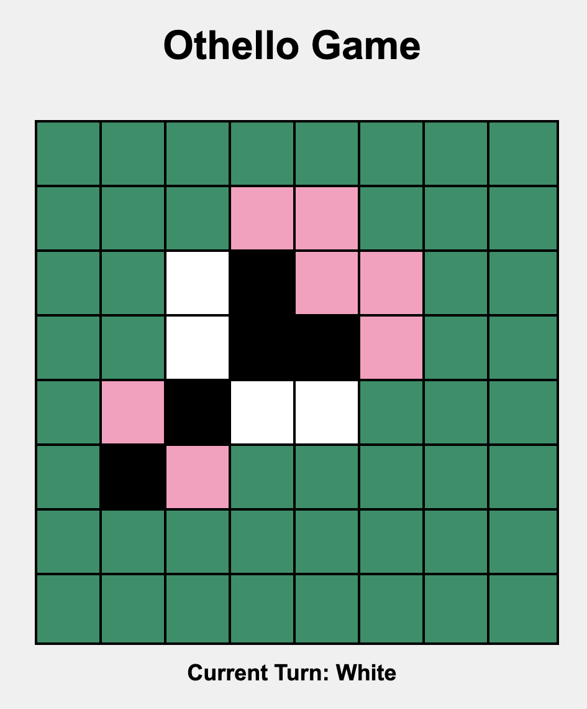
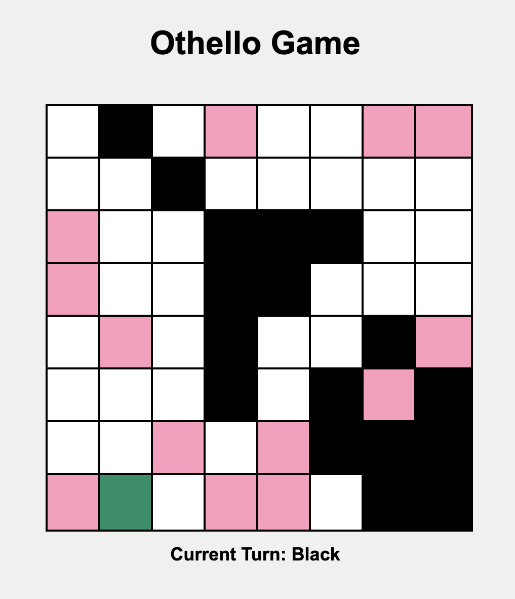

# Othello Game Solver

This is my attempt of making a othello game solver engine using minimax algorithm and alpha-beta pruning to optimise the run time of the algorithm further

I also made a UI using Javascript, HTML, CSS to play the game between two users

The Green blocks represents the unused states, pink ones the possible moves for the player and black and white represents corresponding players blocks at the current state.

## Tech Stack Used

- JavaScript
- HTML
- CSS
- Java

### Follow [Sanchit Singla | Github](https://github.com/sanchit324)
